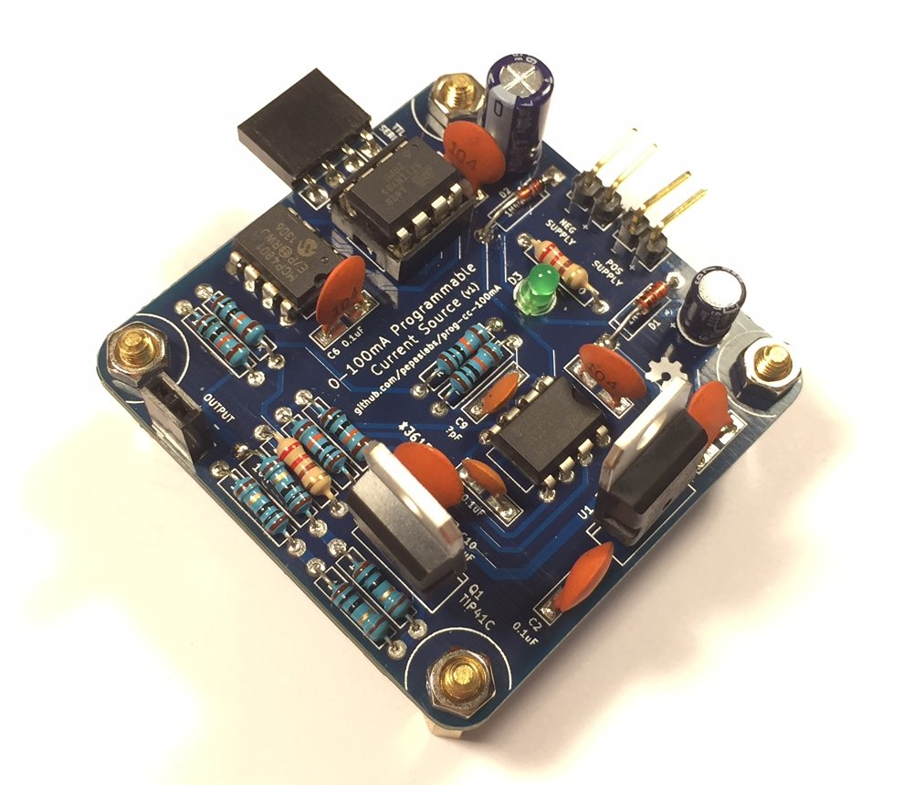
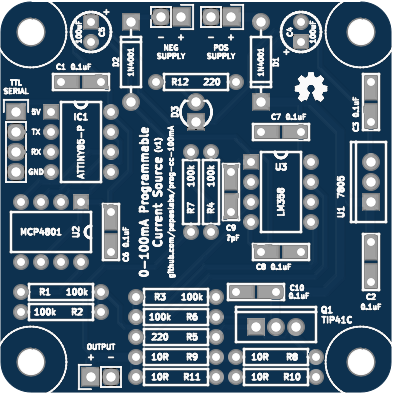
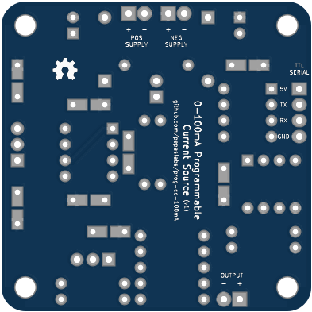
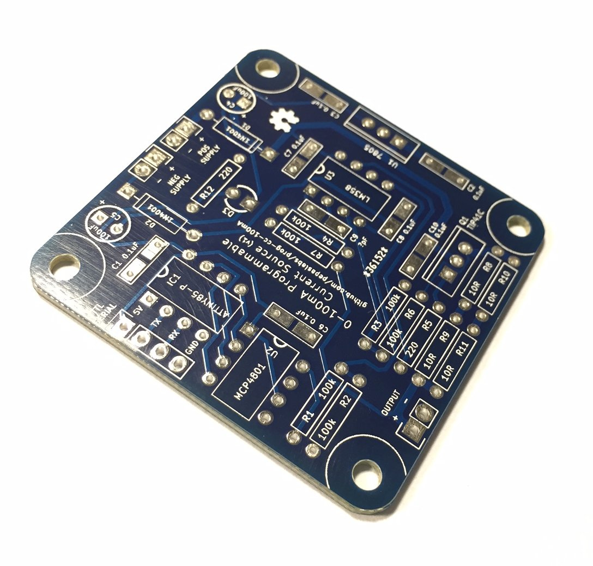

# prog-cc-100mA
A programmable 100mA current source

# Status

This board has been tested and works.

With cheap components, it makes a decent low-precision current source.  I'm currently awaiting the arrival of some low temperature coefficient resistors and low input offset voltage opamps to see if performance can be improved.

# Board design v1

Initial board design.

## Gerbers

[gerbers.zip](kicad/releases/v1/gerbers.zip)

## Schematic

[PDF](kicad/releases/v1/prog-cc-100mA-schematic.pdf).

# License

This board design is [Open-Source Hardware](http://www.oshwa.org/definition/).  It is licensed under the [MIT License](http://opensource.org/licenses/MIT).  It was designed by Jason Pepas.
